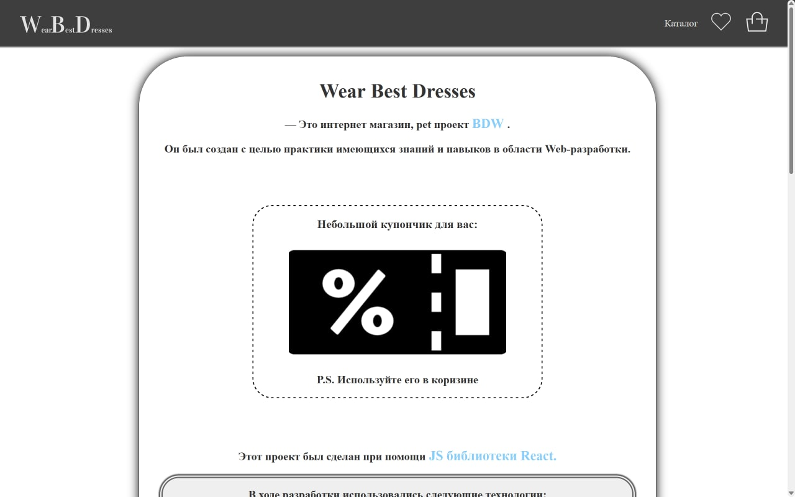
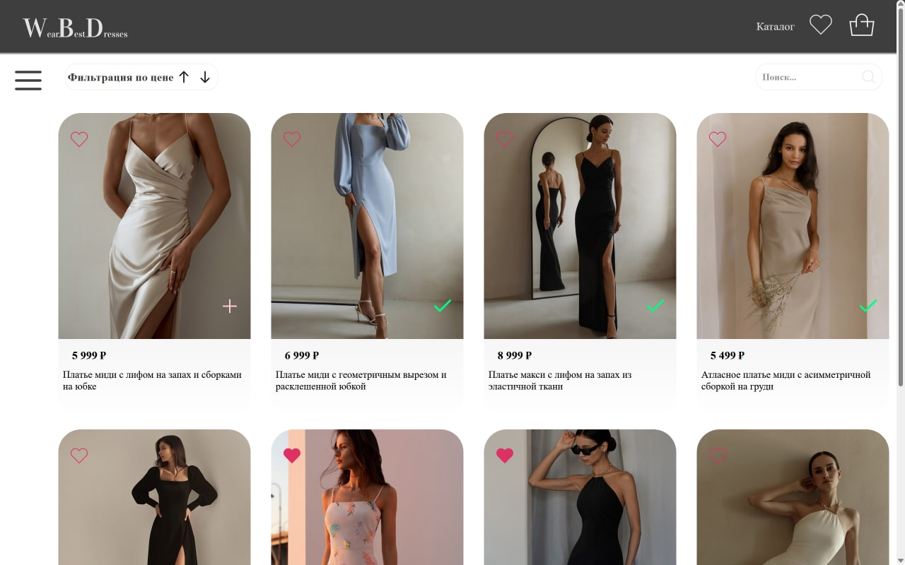
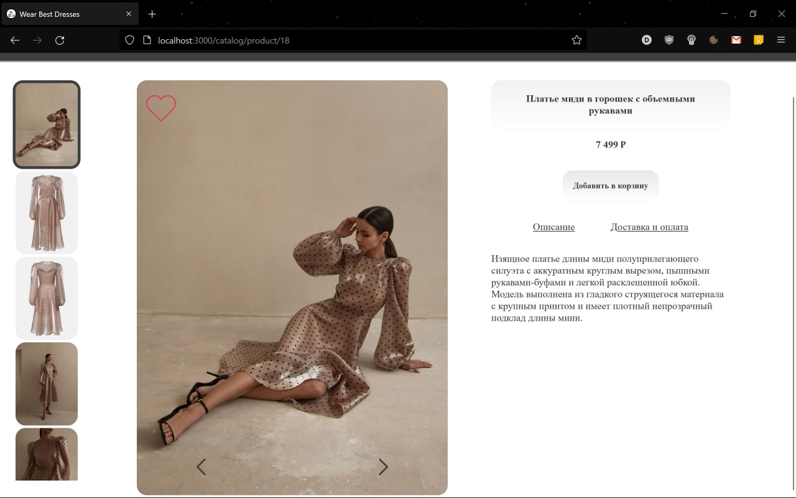
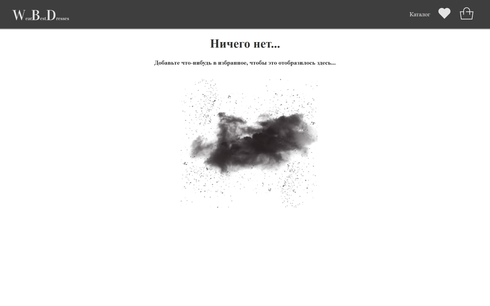
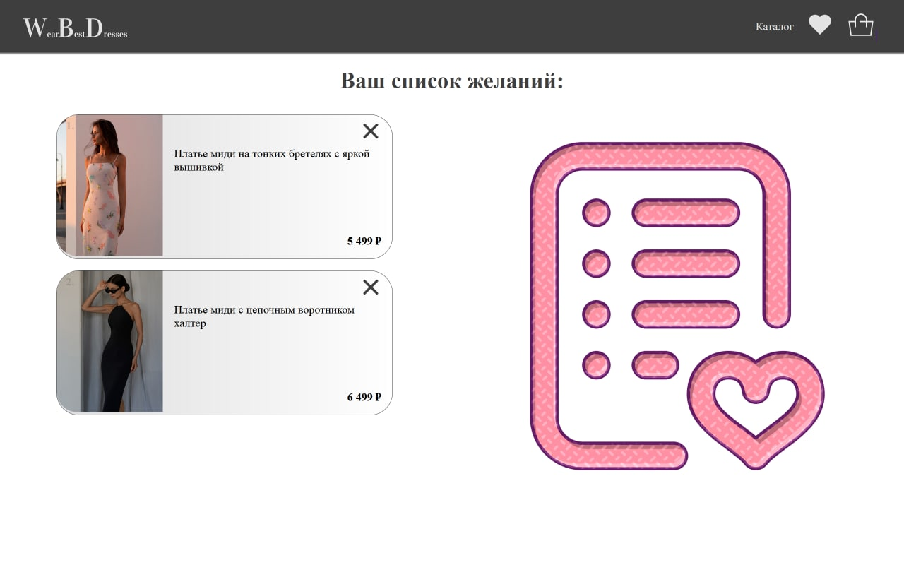
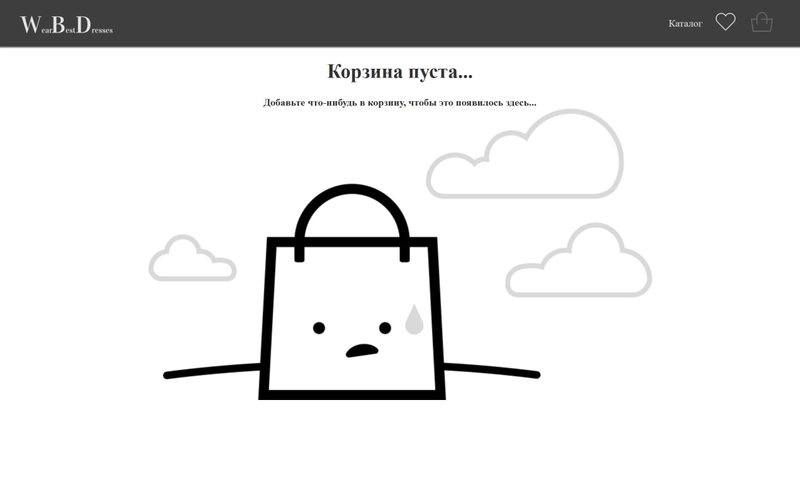
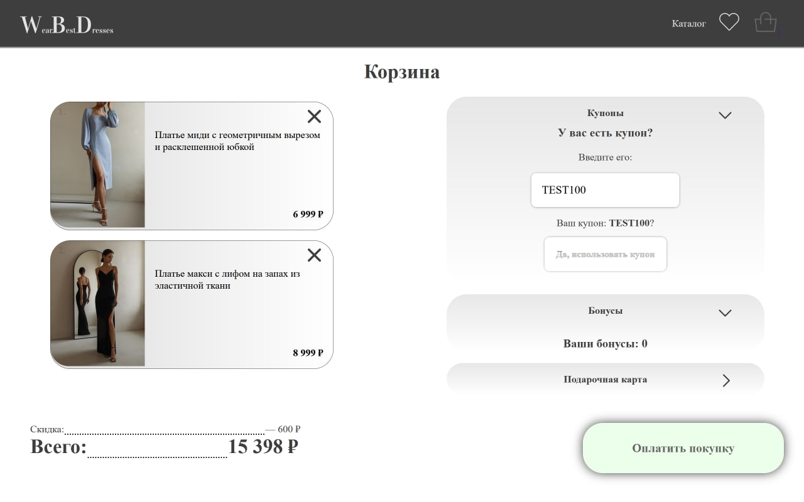

# Wear Best Dresses -- Online Shop

Этот интернет магазин был создан с целью практики имеющихся знаний и навыков в области Web-разработки.

## **(Ссылка на проект)[https://daniilboyarinkov.github.io/WearBestDresses__Online_Shop]**

P.S. Проект был задеплоен на бесплатный хостинг Github Pages. В этой связи наблюдаются серьёзные проблемы с перерисовкой тяжелых фотографий на страницах. Плюс, при обновлении страницы github кидает ошибку роутинга 404. Проект работает и выглядит в разы хуже, чем когда клиентская и серверная части приложения были подняты локально, однако это всё равно гораздо лучше, чем ничего. 

P.S. Ну а если вдруг вы захотите (скорее всего нет, но а вдруг) развернуть этот проект локально, то вам будет необходимо склонировать этот репозиторий, установить необходимые зависимости (отдельно как для серверной так и для клиентской частей командой npm i) и поднять клиентскую и серверную части на разных портах (я использовал 3000 для клиентской части и 5000 для серверной). (команды - npm run start для серверной и npm start - для клиентской частей). Good luck!

# Страницы магазина

### Главная:

### Каталог:

-   Работает фильтр по цене, по категориям и поиск по названию и бренду.

-   Кроме того реализована постраничная пагинация.

### Страница товара:

-   Также реализована возможность добавления в избранное и в корзину из страницы товара.

-   Просмотр фотографий товара переключением стрелочек.

### Избранное:

-   Реализована возможность удаления из закладок.
-   Статус сердечка в хедере отслеживается от нахождения пользователя на странице закладок.

### Корзина:

-   Реализована возможность удаления из корзины.
-   Есть возможность использовать бонусы, купоны и подарочные карты.
-   Цена расчитывается динамически

## Этот проект был сделан при помощи JS библиотеки React.

В ходе разработки использовались следующие технологии:

-   React
-   React-roter-dom
-   React-copy-to-clickboard
-   Express
    -   (для поднятия сервера с необходимыми данными о товарах и раздачей статики)
-   Python Scraping
    -   (для заполнения сервера правдивой информацией о товарах)

---

> I'm just learning
